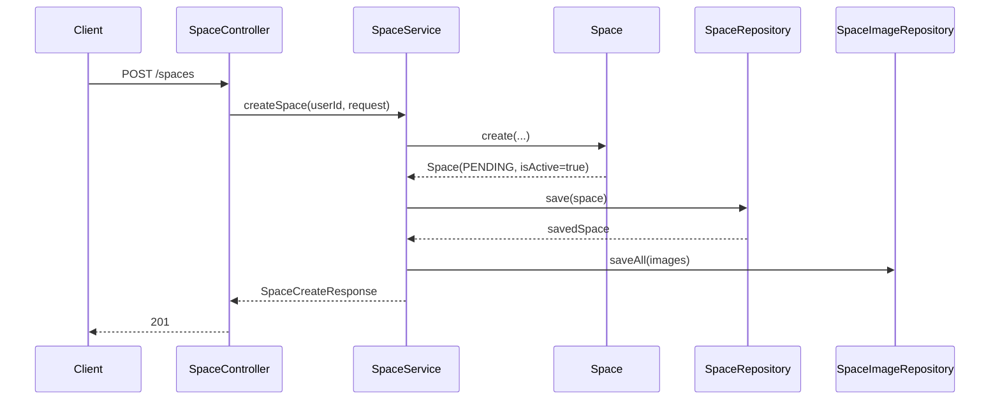
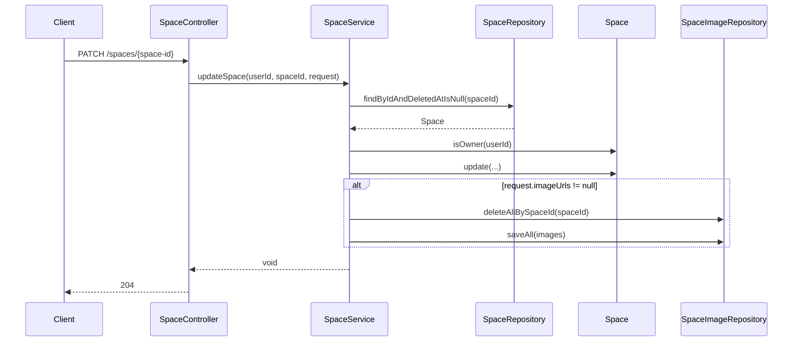
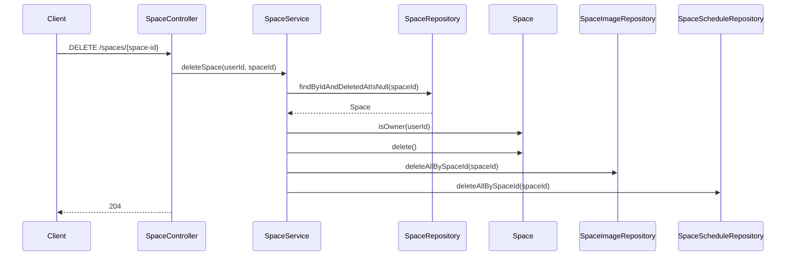
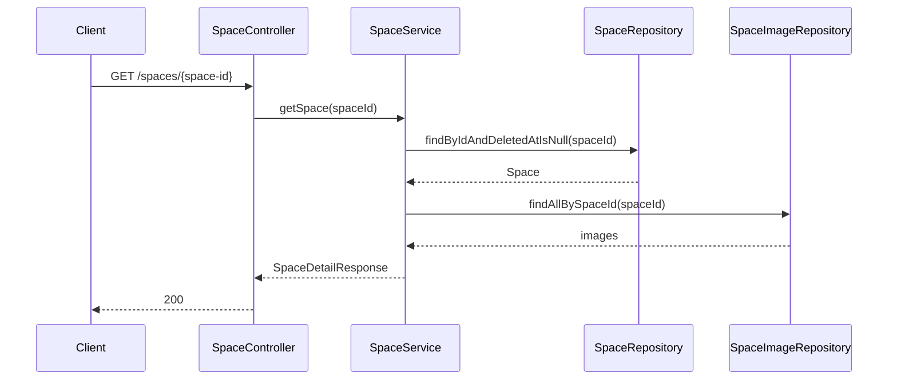
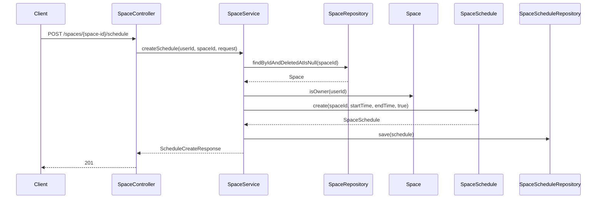

# Space Service Flow

이 문서는 실제 Controller, Service, Entity, Repository 흐름만 정리한다. Reservation, Payment, Member 등 다른 서비스 내부 흐름은 포함하지 않는다.

## 공간 생성 흐름

확인됨:

- `userId`는 JWT principal에서 가져온다.
- 이미지 URL 목록이 null 또는 empty면 이미지 저장을 생략한다.

확인 필요:

- 이미지 URL 생성 주체
- 생성 요청 필수값 정책

## 공간 수정 흐름

확인됨:

- 소유자 검증을 통과해야 한다.
- null이 아닌 필드만 수정된다.

확인 필요:

- 주소와 좌표 수정 제외 의도

## 공간 삭제 흐름

확인됨:

- 공간은 소프트 삭제된다.
- 이미지와 일정은 Repository delete 메서드로 삭제된다.

확인 필요:

- 예약이 있는 공간 삭제 제한

## 공간 단건 조회 흐름

확인 필요:

- 승인 상태 필터 적용 여부
- 비활성 공간 노출 여부

## 공간 목록 조회 흐름

확인됨:

- `name`과 `category` 조건 조합에 따라 `SpaceRepository` 메서드를 선택한다.
- 모든 분기에서 `DeletedAtIsNull` 조건을 사용한다.
- `ApprovalStatus`와 `isActive`는 현재 목록 조회 조건에 사용되지 않는다.

확인 필요:

- 공개 목록에 `APPROVED`만 노출해야 하는지
- pagination과 정렬 기준

## 내 공간 조회 흐름

확인됨:

- JWT principal의 `userId`를 `hostId`로 사용한다.
- `name`, `category` 조건을 조합해 host 기준 Repository 메서드를 선택한다.
- 응답에는 `adminStatus`와 `isActive`가 포함된다.

주의:

- `GET /spaces/me`는 인증이 필요하지만 `SecurityConfig` matcher 순서상 공개 접근 위험이 있다.

## 공간 이미지 저장 흐름

확인됨:

- `SpaceService.saveImages`는 `imageUrls`가 null 또는 empty면 아무 작업도 하지 않는다.
- URL 목록이 있으면 `SpaceImage.create(spaceId, imageUrl)`로 변환한 뒤 `saveAll`한다.
- 공간 수정 시 `imageUrls != null`이면 기존 이미지를 모두 삭제한 뒤 다시 저장한다.

확인 필요:

- 이미지 업로드와 파일 삭제 책임

## 일정 생성 흐름

확인됨:

- 소유자만 생성할 수 있다.
- 시작 시간과 종료 시간의 순서를 검증한다.

확인 필요:

- 일정 중복 검증
- 예약 충돌 검증

## 일정 조회 흐름

확인됨:

- 삭제되지 않은 공간인지 먼저 확인한다.
- `findAllBySpaceIdOrderByStartTimeAsc`로 조회한다.
- 응답 DTO에서 날짜별로 그룹핑한다.
- `isBookable`은 `AVAILABLE` 또는 `BLOCKED` 문자열로 변환된다.

확인 필요:

- timezone 정책

## 일정 수정 흐름

확인됨:

- 삭제되지 않은 공간인지 확인한다.
- 소유자 검증을 수행한다.
- `findByIdAndSpaceId`로 일정을 조회한다.
- 요청 값이 null이면 기존 값을 유지한다.
- 수정 시 시간 유효성을 다시 검증한다.

확인 필요:

- 예약된 일정 수정 제한

## 일정 삭제 흐름

확인됨:

- 삭제되지 않은 공간인지 확인한다.
- 소유자 검증을 수행한다.
- `findByIdAndSpaceId`로 일정을 조회한다.
- `spaceScheduleRepository.delete(schedule)`로 삭제한다.

확인 필요:

- 예약된 일정 삭제 제한

## 호스트 권한 검증 흐름

확인됨:

- `SpaceService.validateOwner`가 `space.isOwner(userId)`를 호출한다.
- `Space.isOwner`는 `hostId.equals(userId)`로 판단한다.
- 실패 시 `SecurityException("해당 공간에 대한 권한이 없습니다.")`가 발생한다.

적용 흐름:

- 공간 수정
- 공간 삭제
- 일정 생성
- 일정 수정
- 일정 삭제
